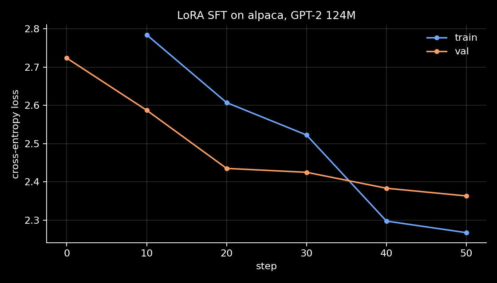

# Full Transformer

From the attention formula to an instruction-tuned GPT-2, written by hand in PyTorch.
Every layer here is implemented from scratch; Hugging Face is used only as a source of
pretrained weights and datasets, never as the model itself.


-000000?logo=apple)

## What's inside

| Stage | What was built | Artifact |
| --- | --- | --- |
| 1. Transformer from scratch | Scaled dot-product attention, multi-head attention, positional encoding, FFN, encoder and decoder stacks, full encoder-decoder model | [01-transformer-notebook/net+transformer.ipynb](01-transformer-notebook/net+transformer.ipynb) |
| 2. GPT-2 reimplementation | Decoder-only GPT-2 with layer names matching HF, so the 124M pretrained weights load key by key | [reproducing_gpt-2.py](02-gpt2-from-scratch/reproducing_gpt-2.py) |
| 3. Supervised fine-tuning | Alpaca-style instruction tuning with LoRA, prompt tokens masked out of the loss | [lora_sft_ckpt/](02-gpt2-from-scratch/lora_sft_ckpt/) |

## Results



| | |
| --- | --- |
| Base model | GPT-2 124M (124,439,808 params) |
| Trainable LoRA params | 1,179,648 (0.94%) |
| LoRA config | `r=8`, `alpha=16`, `dropout=0.05`, targets `c_attn` / `c_proj` / `c_fc` |
| Optimizer | AdamW, lr `1e-4`, batch 4, block 256 |
| Final train / val loss | 2.27 / 2.36 |
| Loss tokens per batch | ~25% of positions (the rest are prompt and padding, masked with `-100`) |
| Hardware | MacBook, MPS backend |

The curve above covers the last fine-tuning session (logged every 10 steps); the checkpoint
carries earlier sessions too. Both stayed in the regime where val tracks train, so the run
stopped for time rather than for overfitting.

## Sample generations

Same model, same seed, same sampling (`temperature=0.9`, `top_k=50`). "Base" is the adapter
switched off via `disable_adapter()`, so the only difference is the LoRA delta.

<table>
<tr><th>Base GPT-2</th><th>+ LoRA SFT</th></tr>
<tr><td colspan="2"><em>Instruction: Give three tips for staying healthy.</em></td></tr>
<tr>
<td>I'd like to remind the world that you are an important part of your life. As I say in my message below, I do not intend to preach a message to be preached to everyone...</td>
<td>If you are taking medications and are taking the right medications, a diet and exercise plan should be in place. If you are taking a high-fiber diet, it is important to not take any medications that can become problematic...</td>
</tr>
<tr><td colspan="2"><em>Instruction: Classify the sentiment of the sentence. Input: The movie was way too long and I fell asleep.</em></td></tr>
<tr>
<td>&lt;p&gt;It's probably more a film-related thing. So I was like &gt;.&gt; If you want to make a movie about anything more than a film, send a message to me...</td>
<td>It is. It is. It is. It is. It is. It is. It is. It is...</td>
</tr>
</table>

Read honestly: the adapter teaches the model the *shape* of an answer, not the task. It stops
drifting into web-page noise and stays on topic, but 124M parameters and a short LoRA run are
nowhere near enough for actual instruction following. Reproduce with the block at the end of
[reproducing_gpt-2.py](02-gpt2-from-scratch/reproducing_gpt-2.py#L427).

### Why the second answer loops

The `It is. It is. It is.` collapse is left in on purpose, because it is not random bad luck:

1. **The model was never taught to stop.** `format_example` builds the target as
   `prompt + output` with no `<|endoftext|>` appended, and padding positions are masked with
   `-100`. So no end-of-sequence token is ever a training target, and the model has no way to
   learn that an answer can be over.
2. **The sampler can't stop either.** [`generate`](02-gpt2-from-scratch/reproducing_gpt-2.py#L169)
   always runs the full `max_new_tokens` with no EOS break and no repetition penalty.
3. **Short answers make it worse.** Alpaca classification targets are one or two words, so the
   distribution right after `###Response:` is sharply peaked; `top_k=50` then keeps resampling
   from the same tiny high-probability set, and the sequence becomes its own strongest context.

The base model doesn't loop here only because it never entered a short-answer mode in the first
place; it rambles instead. The fix is not more training: append EOS to SFT targets, train on it,
and break generation on it. That's the first item in the roadmap below.

## Repo structure

```
01-transformer-notebook/
    net+transformer.ipynb        MLP on MNIST from raw tensors, then the full transformer
02-gpt2-from-scratch/
    reproducing_gpt-2.py         model, data pipeline, training loop, weight porting, SFT
    lora_sft_ckpt/               LoRA adapter + history.json with the loss curves
scripts/plot_history.py          renders assets/sft_loss.png from history.json
assets/                          figures used in this README
```

## Stage 1 — Transformer from scratch

The notebook walks up from raw tensors: a hand-rolled MLP on MNIST with manual `W @ x` and
`.backward()`, then the same net through `nn.Module`, then the transformer of *Attention Is All
You Need*:

- `ScaledDotProductAttention` with the `-inf` masking trick before softmax
- `MultiHeadAttention` as one `d_model → d_model` projection reshaped into `h` heads
- sinusoidal `positional_encoding` registered as a buffer, not a parameter
- `EncoderLayer` / `DecoderLayer` with self-attention, cross-attention and pre-norm residuals
- assembled `Transformer(src_vocab, tgt_vocab)` validated by shape tests and parameter counts

## Stage 2 — GPT-2 reimplementation

[reproducing_gpt-2.py](02-gpt2-from-scratch/reproducing_gpt-2.py) contains a decoder-only GPT-2:
`CausalSelfAttention` with a `tril` buffer mask, `MLP` with a 4x hidden dimension, pre-norm
blocks, learned position embeddings.

The point of the stage was [`load_pretrained`](02-gpt2-from-scratch/reproducing_gpt-2.py#L359):
the module tree is named exactly like HF `GPT2LMHeadModel` (`transformer.wte` / `wpe` / `h.{i}` /
`ln_f`, `lm_head`), so the official 124M checkpoint copies over key by key, with two asserts that
fail loudly if a single tensor is missed or has the wrong shape. Details that decide whether the
port is correct:

- HF stores attention and MLP weights in `Conv1D` layout `(in, out)`; `nn.Linear` wants
  `(out, in)`, so four weight names get transposed
- `wte.weight` and `lm_head.weight` are tied, so the copy has to account for one tensor filling
  two keys
- GELU must be the `tanh` approximation (`gelu_new` in HF); the exact one gives different logits
- HF's causal mask lives in the state dict as `attn.bias` and is skipped, since it is a buffer here

Initialization follows GPT-2: `N(0, 0.02)`, with residual projections scaled by
`0.02 / sqrt(2 * n_layer)` so activations don't grow with depth.

## Stage 3 — Supervised fine-tuning with LoRA

Data is `tatsu-lab/alpaca`, formatted as:

```
###Instruction:
{instruction}

###Input:          <- only when the example has one
{input}

###Response:
{output}
```

The part that matters is [`get_batch_sft`](02-gpt2-from-scratch/reproducing_gpt-2.py#L266):
targets for prompt positions and for padding are set to `-100` and dropped from the loss via
`ignore_index`, so the model is trained to *produce* responses, not to memorize instructions.
Batches are padded to the longest sequence in the batch rather than to `block_size`, which keeps
most batches far below 256 tokens.

LoRA (`peft`) was chosen because full fine-tuning of 124M parameters on an MPS laptop is
impractical: 0.94% of the parameters train, the adapter is 4.7 MB on disk, and the base weights
stay frozen and reusable. `train_model` handles all three regimes (`pretrained`, `sft`, `lora`)
with one loop and per-regime learning rates.

## Implementation notes

Things that cost time and are worth knowing:

- **A silent checkpoint fallback is worse than a crash.** `load_checkpoint_lora` used to fall back
  to a freshly initialized adapter when the path didn't resolve, and since the path was relative,
  running the script from a different directory silently generated with an untrained adapter.
  Now the path is derived from `__file__` and a missing checkpoint raises.
- **`-100` does nothing without `ignore_index`.** The masking code was there from the start, but
  `F.cross_entropy` was called without `ignore_index=-100`, so the loss was computed over prompt
  and padding tokens too. Verified after the fix: ~75% of target positions are masked.
- **Slicing a list doesn't always copy what you think.** `y[:prompt_len] = [-100] * ...` was
  writing into the list stored in the dataset, so re-sampling the same example returned data that
  had already been corrupted by a previous mask.
- **`eval()` has to be undone.** The validation helper switched the model to `eval()` and never
  switched back, which silently disabled LoRA dropout for the rest of training.
- **Checkpoint after `optimizer.step()`, not before.** Otherwise the file on disk is one step
  stale relative to the reported loss.

## Running it

```bash
pip install -r requirements.txt
python 02-gpt2-from-scratch/reproducing_gpt-2.py   # loads the adapter and generates
python scripts/plot_history.py                     # regenerates assets/sft_loss.png
```

The script downloads GPT-2 weights and the alpaca dataset on first run. Training is off by
default (`num_steps=0`); raise it and flip `loading=False` to start a fresh adapter.

## Roadmap

- EOS handling end to end: append `<|endoftext|>` to SFT targets, keep it unmasked, stop
  `generate` on it (see the repetition analysis above)
- KV-cache in `generate` (currently the full prefix is recomputed for every token)
- `F.scaled_dot_product_attention` instead of the explicit softmax path
- RoPE and RMSNorm, to move from GPT-2 to a modern Llama-style block
- a real eval instead of loss alone: held-out instruction following, MMLU-style scoring
- preference tuning (DPO) on top of the SFT checkpoint
